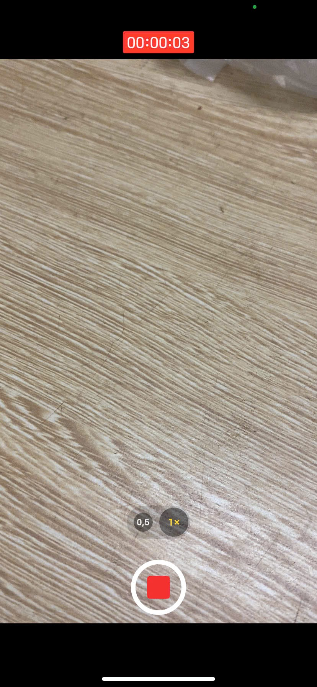
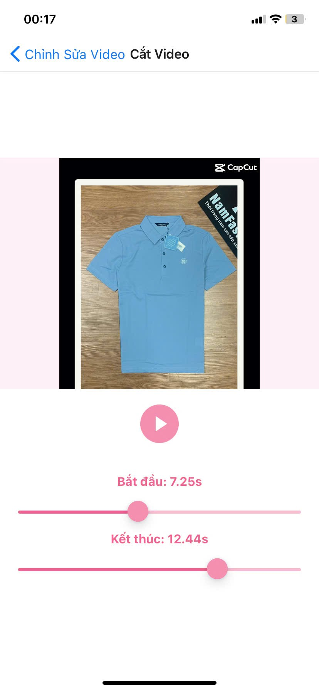

 **TRƯỜNG ĐẠI HỌC XÂY DỰNG HÀ NỘI**

**KHOA CÔNG NGHỆ THÔNG TIN**

**ĐỒ ÁN PHÁT TRIỂN ỨNG DỤNG ĐA NỀN TẢNG**

**ĐỀ TÀI : XÂY DỰNG ỨNG DỤNG CHỈNH SỬA ẢNH VÀ VIDEO**

**Giảng viên hướng dẫn : Ths. Nguyễn Đình Quý**

**Nhóm : 8**

**Sinh viên : Trương Đức Việt -- 0295867 -- 67CS2**

**Bạch Hưng Bảo -- 0016867-- 67CS2**

**Tôn Văn Dân -- 0113167 -- 67CS2**

**Hoàng Quốc Vũ -- 4005667 -- 67CS2**

**TÓM TẮT**

Trong bối cảnh nhu cầu chỉnh sửa ảnh và video ngày càng tăng cao trên
thiết bị di động, đặc biệt là trên cả hai nền tảng Android và iOS, nhóm
chúng tôi đã phát triển một ứng dụng đa nền tảng hỗ trợ chụp ảnh, quay
video và thực hiện các thao tác chỉnh sửa cơ bản. Ứng dụng được xây dựng
bằng React Native kết hợp với Expo, tận dụng nhiều thư viện mã nguồn mở
như react-native-vision-camera, react-native-image-picker,
react-native-image-crop-picker và tích hợp API remove.bg, Pixelixe API ,
Imgur API để xóa nền ảnh tự động và sử dụng bộ lọc.Các chức năng chính
bao gồm:Chụp ảnh và quay video bằng camera của thiết bị.Tải ảnh/video từ
thư viện.Chỉnh sửa ảnh: cắt, xoay, lật, xóa nền, thêm bộ lọc, chèn văn
bản.Chỉnh sửa video: cắt, xoay, thay đổi tốc độ.Lưu ảnh/video sau chỉnh
sửa về thiết bị.

Ứng dụng được thiết kế với giao diện trực quan, dễ sử dụng, phù hợp với
người dùng phổ thông. Toàn bộ xử lý ảnh và video được thực hiện phía
client, đảm bảo tốc độ và hiệu suất. Kết quả thử nghiệm cho thấy ứng
dụng hoạt động ổn định trên cả hai nền tảng iOS và Android, đáp ứng được
các nhu cầu chỉnh sửa cơ bản trong cuộc sống hằng ngày.

**Chương 1 : MỞ ĐẦU**

**1.1 Bối Cảnh**

Trong kỷ nguyên số hóa hiện nay, nhu cầu tạo ra và chia sẻ nội dung hình
ảnh và video ngày càng trở nên phổ biến và thiết yếu, đặc biệt là trên
các nền tảng mạng xã hội như Facebook, Instagram, TikTok, Zalo,\...
Người dùng không chỉ muốn chụp và lưu giữ những khoảnh khắc mà còn mong
muốn có thể chỉnh sửa, làm đẹp, hoặc sáng tạo thêm nội dung trước khi
chia sẻ. Các ứng dụng chỉnh sửa ảnh và video chuyên dụng như BeautyPlus,
VSCO, CapCut,\... tuy cung cấp nhiều tính năng mạnh mẽ nhưng lại thường
khá nặng, giới hạn nền tảng hoặc yêu cầu trả phí.

Bên cạnh đó, việc phát triển ứng dụng trên cả hai hệ điều hành phổ biến
là Android và iOS luôn đặt ra thách thức về chi phí, thời gian và nguồn
lực. Trong bối cảnh đó, công nghệ lập trình đa nền tảng (cross-platform)
nổi lên như một giải pháp hiệu quả, cho phép các nhóm phát triển xây
dựng ứng dụng một lần và triển khai được trên nhiều hệ điều hành. React
Native -- một framework phổ biến do Facebook phát triển -- cùng với nền
tảng Expo giúp đơn giản hóa quy trình phát triển, kiểm thử và triển khai
ứng dụng mobile.

Từ những lý do trên, nhóm chúng tôi quyết định thực hiện đề tài xây dựng
ứng dụng chụp và chỉnh sửa ảnh/video trên nền tảng React Native với
Expo, hướng đến việc cung cấp một công cụ nhẹ, dễ sử dụng, hỗ trợ các
thao tác cơ bản nhưng thiết thực, đồng thời đảm bảo hoạt động mượt mà
trên cả Android và iOS. Đây không chỉ là một sản phẩm phục vụ thực tiễn
mà còn là cơ hội để nhóm tiếp cận và áp dụng các công nghệ hiện đại
trong lập trình di động đa nền tảng.

**1.2 Hướng tiếp cận**

Sử dụng ứng dụng React Native cùng Expo để phát triển một ứng dụng di
động hoạt động hiệu quả trên cả Android và iOS, đồng thời tận dụng khả
năng \"viết một lần -- chạy mọi nơi\", giúp tiết kiệm thời gian và công
sức so với phát triển riêng biệt cho từng nền tảng.

Tìm hiểu và triển khai các thư viện mã nguồn mở như
react-native-vision-camera, react-native-image-picker,
react-native-image-crop-picker để thực hiện các thao tác như chụp ảnh,
chọn ảnh từ thư viện, cắt, xoay, lật ảnh, chèn văn bản. Đặc biệt, tích
hợp API remove.bg , Pixelixe API , Imgur API để tự động xóa nền ảnh và
sử dụng bộ lọc, mang đến sự tiện lợi cho người dùng mà không cần xử lý
thủ công phức tạp.

Thiết kế trải nghiệm người dùng (UX) và giao diện người dùng (UI) có bố
cục đơn giản, dễ tiếp cận, đặc biệt hướng đến nhóm người dùng phổ thông.
Các chức năng được phân chia rõ ràng, thao tác nhanh chóng, trực quan,
đảm bảo hiệu quả sử dụng trong thực tế.

**1.3 Cấu trúc của báo cáo**

Báo cáo được tổ chức thành sáu chương chính nhằm trình bày một cách hệ
thống mạch lạc từ bối cảnh đến kết quả và định hướng phát triển:

Chương 1: Giới thiệu : Trình bày tổng quan về đề tài bao gồm bối cảnh
nghiên cứu, hướng nghiên cứu chính, mục tiêu, phạm vi và phương pháp
thực hiện.

Chương 2: Cơ sở lý thuyết : Trình bày các kiến thức nền tảng và công
nghệ liên quan đến đề tài, bao gồm khái niệm về lập trình đa nền tảng,
React Native, Expo, các thư viện xử lý ảnh/video, và API xóa nền , bộ
lọc.

Chương 3: Cài đặt và triển khai : Trình bày quá trình cài đặt môi trường
phát triển, cấu trúc mã nguồn, mô tả các chức năng chính được lập trình
và quá trình tích hợp các thư viện, API

Chương 4: Kết quả và đánh giá : Trình bày kết quả thực nghiệm, đánh giá
hiệu quả sử dụng, hiệu suất và các khó khăn gặp phải trong quá trình
phát triển.

Chương 5: Kết luận và hướng phát triển : Tóm tắt đóng góp chính, chỉ ra
hạn chế và đề xuất các hướng mở rộng và ứng dụng thực tế

> **Chương 2 : CƠ SỞ LÝ THUYẾT**

**2.1 Lập trình đa nền tảng**

Lập trình đa nền tảng là việc viết code để tạo ra các phần mềm, ứng
dụng, hoặc chương trình hoạt động trên nhiều hệ điều hành hoặc nền tảng
khác nhau, ví dụ như Windows, MacOS, iOS, Android,\... Nói cách khác,
ứng dụng hoặc phần mềm đó được viết một lần và có thể chạy trên nhiều hệ
điều hành mà không cần thay đổi mã nguồn.Ưu điểm chính của phương pháp
này là dễ dàng tiếp cận khách hàng mục tiêu , tối ưu thời gian và chi
phí , tạo ra và duy trì sự đồng bộ hoá ,\...

Một số công nghệ phổ biến cho lập trình đa nền tảng gồm: React Native,
Flutter, Xamarin, Ionic,\... Trong đề tài này, nhóm sử dụng React Native
kết hợp Expo để phát triển ứng dụng vì tính thân thiện, tài liệu phong
phú và cộng đồng lớn.

**2.2 React Native và Expo**

**2.2.1 React Native**

React Native là một framework được phát hành lần đầu năm 2015. Tuy nhiên
cho đến tháng 11 năm 2019 hoàn thiện phiên bản ổn định. Được ra đời với
mục đích phát triển những ứng dụng di động trên nhiều hệ điều hành, tiêu
biểu IOS hay Android. Lập trình viên có thể sử dụng ngôn ngữ JavaScript
xây dựng những ứng dụng di động. Những ứng dụng đa nền tảng được sự trợ
giúp đắc lực với React Native.

**2.2.2 Expo**

Expo là một bộ công cụ và dịch vụ tích hợp hỗ trợ mạnh mẽ cho quá trình
phát triển ứng dụng React Native, cho phép các lập trình viên dễ dàng
triển khai ứng dụng trên nhiều nền tảng như iOS và Android mà không cần
cấu hình phức tạp. Với Expo, người dùng tận dụng các API sẵn có, bộ công
cụ xây dựng đơn giản, và khả năng chia sẻ ứng dụng qua QR code, giúp đẩy
nhanh tiến độ phát triển và tối ưu hiệu quả làm việc. Ưu điểm của Expo :

Cài đặt nhanh chóng: Expo cung cấp một môi trường làm việc sẵn có, giúp
tiết kiệm thời gian cài đặt ban đầu. Các công cụ có sẵn của Expo giúp
bạn bắt đầu ngay lập tức mà không cần cấu hình phức tạp.

Phát triển và kiểm thử nhanh: Expo Go cho phép bạn xem trước ứng dụng
theo thời gian thực trên nhiều thiết bị, giúp tối ưu hóa quá trình phát
triển và giảm thời gian thử nghiệm.

Tài liệu đầy đủ: Hệ thống tài liệu của Expo được tổ chức rõ ràng, giúp
lập trình viên, đặc biệt là người mới bắt đầu, dễ dàng tra cứu và sử
dụng.

Thư viện API phong phú: SDK của Expo đi kèm nhiều API và thành phần sẵn
có như cảm biến, camera, và định vị GPS, giúp giảm bớt thời gian viết mã
cho các tính năng cơ bản.

Quản lý phụ thuộc: Expo quản lý các thư viện và bản cập nhật, đảm bảo
tính tương thích của mã nguồn mà không cần cấu hình thủ công từng thư
viện.

**2.3 Thư viện công nghệ sử dụng**

**2.3.1 Thư viện sử dụng**

expo-image-picker : Thư viện cho phép chọn hình ảnh/video từ thư viện
hoặc chụp ảnh bằng camera trong ứng dụng Expo.

expo-media-library : Truy cập và quản lý thư viện đa phương tiện trên
thiết bị.

expo-image-manipulator : Chỉnh sửa hình ảnh như xoay, lật, thay đổi kích thước, nén

 expo-file-system : Quản lý tệp và thư mục trên thiết bị

 react-native-view-shot : Chụp ảnh màn hình của một View trong ứng dụng.

expo-av: Thư viện phát video mạnh mẽ, hỗ trợ phát lại, tạm dừng, tua và
thay đổi tốc độ phát.

Axios : Thư viện thực hiện yêu cầu HTTP

**2.3.2 API tích hợp**

Pixelixe API: Xử lý bộ lọc

Imgur API: Tải lên và chia sẻ ảnh từ ứng dụng React Native, tích hợp với
expo-image-picker để chọn ảnh.

remove.bg API: Xóa nền ảnh , kết hợp với expo-file-system để lưu trữ.

**2.4 Kỹ thuật xử lý ảnh và video**

Crop (Cắt ảnh): Lựa chọn vùng ảnh cần giữ lại, loại bỏ phần dư thừa.

Rotate (Xoay ảnh): Thay đổi hướng ảnh theo các góc (90°, 180°, 270°).

Flip (Lật ảnh): Lật ngang hoặc lật dọc ảnh, giúp tạo hiệu ứng gương soi
hoặc đảo chiều.

Background removal (Xóa nền): Loại bỏ nền ảnh, giữ lại chủ thể chính. Có
thể kết hợp với các nền màu khác để tạo ảnh mới.

Filters (Bộ lọc): Làm thay đổi màu sắc, độ tương phản, độ bão hòa,... để
tạo hiệu ứng thị giác đặc biệt.

Text Overlay ( Chèn văn bản ) : Cho phép thêm văn bản vào ảnh để ghi chú
, có thể chỉnh kích thước , vị trí , màu sắc văn bản.

Trim Video (Cắt Video): Cho phép người dùng chọn khoảng thời gian bắt
đầu và kết thúc để tạo một đoạn video ngắn hơn từ video gốc.

Rotate (Xoay video ): Hữu ích khi người dùng quay video bị sai hướng; có
thể xoay 90°, 180° hoặc 270°.

Playback speed (Tăng/Giảm tốc độ phát): Cho phép người dùng phát video
nhanh hơn hoặc chậm hơn bình thường (0.5x, 1.5x, 2x,...).

> **Chương 3 : CÀI ĐẶT VÀ TRIỂN KHAI**

**3.1 Môi trường phát triển**

Để xây dựng ứng dụng chỉnh sửa ảnh và video, nhóm sử dụng các công cụ và
môi trường như sau:

Hệ điều hành : Window 11

IDE : Visual Studio Code

Ngôn ngữ : JavaScript (ES6+), JSX

Framework : React Native (với Expo)

Trình giả lập : Expo Go (trên Android và iOS)

Trình quản lý gói : npm / yarn

Phiên bản Expo SDK : 50

**3.2 Cài đặt dự án**

**3.2.1 Khởi tạo dự án**

**3.2.2 Cài đặt các thư viện cần thiết**

**3.3 Cấu trúc thư mục chính**

**3.4 Kiểm thử và triển khai trên thiết bị thật**

**Lệnh chạy dự án :**

Mọi chức năng đều được test trên thiết bị Android và iOS bằng cách quét
mã QR từ Expo Go.

Ứng dụng chạy ổn định, hiệu năng tốt nhất với ảnh/video có độ phân giải
trung bình.

Mức độ hỗ trợ chức năng :
 | Chức năng                  | Thiết bị Android | Thiết bị iOS |
|----------------------------|------------------|--------------|
| Chụp ảnh, quay video       | X                | X            |
| Chỉnh sửa ảnh (crop, rotate, flip) | X        | X            |
| Áp dụng bộ lọc ảnh         | X                | X            |
| Cắt, xoay video            | X                | X            |
| Lưu ảnh/video vào thư viện | X                | X            |

**Chương 4 : KẾT QUẢ VÀ ĐÁNH GIÁ**

**4.1 Kết quả triển khai**
| Thao tác          | Thời gian | Kết quả                           |
|-------------------|-----------|------------------------------------|
| Mở app            | 3s-5s     |               |
| Camera            | 1s        |               |
| Mở thư viện       | 1s        |               |
| Chỉnh sửa ảnh     | 1s        |               |
| Lật               | 3s        |               |
| Xoay              | 5s-7s     |               |
| Cắt ảnh           | 2s        |               |
| Xoá phông         | 5s        |              |
| Bộ lọc            | 15s       |              |
| Chèn văn bản      | 1s        |              |
| Lưu ảnh           | 1s        |              |
| Video             | 1s        |              |
| Chỉnh sửa video   | 3s        |              |
| Cắt video         | 3s        |              |
| Xoay video        | 2s        |              |
| Tốc độ phát       | 2s        |              |
| Lưu Video         | 1s        |              |
 
   
   
 
**4.2 Đánh giá**

**Đánh giá tổng quan :**

Sau quá trình phát triển và kiểm thử trên nhiều thiết bị Android và iOS,
ứng dụng đã cho thấy khả năng vận hành ổn định, hiệu năng tốt, đồng thời
đảm bảo đầy đủ các chức năng cơ bản của một ứng dụng chỉnh sửa ảnh và
video trên thiết bị di động.

Ứng dụng cho phép người dùng chụp ảnh, quay video, tải ảnh từ thư viện,
thực hiện các thao tác chỉnh sửa ảnh như cắt, xoay, lật, xóa nền, áp
dụng bộ lọc, chèn văn bản. Đối với video, ứng dụng hỗ trợ các chức năng
chỉnh sửa cơ bản như cắt video, xoay video và điều chỉnh tốc độ phát.

Giao diện người dùng được thiết kế đơn giản, dễ sử dụng, đặc biệt phù
hợp với người dùng phổ thông không có kiến thức kỹ thuật.

Các chức năng đều được thử nghiệm kỹ lưỡng trên nhiều thiết bị khác nhau
và đạt được kết quả ổn định, không xảy ra lỗi nghiêm trọng trong quá
trình sử dụng.

**Đánh giá trên các chức năng :**

Chức năng chụp ảnh và quay video hoạt động ổn định, mở camera nhanh
chóng chỉ trong khoảng 1 giây và không ghi nhận lỗi trên cả Android lẫn
iOS. Tương tự, việc chọn ảnh hoặc video từ thư viện thiết bị diễn ra
mượt mà, thời gian phản hồi tốt, cho phép người dùng thao tác chính xác
và thuận tiện.

Các thao tác chỉnh sửa ảnh cơ bản như cắt, xoay, lật được thực hiện với
tốc độ nhanh (2--5 giây), kết quả hiển thị tức thì, mang lại trải nghiệm
mượt mà. Tính năng xóa nền ảnh sử dụng API remove.bg cũng hoạt động hiệu
quả, trả về ảnh đã xử lý sau khoảng 5 giây với độ chính xác cao, tách
chủ thể rõ ràng. Trong khi đó, chức năng áp dụng bộ lọc ảnh được thực
hiện thông qua Pixelixe API, cho ra kết quả đẹp và đa dạng hiệu ứng, tuy
nhiên cần khoảng 15 giây để xử lý mỗi ảnh ,một thời gian chấp nhận được
do ảnh hưởng từ mạng và độ phức tạp xử lý.

Tính năng chèn văn bản vào ảnh vận hành đơn giản, trực quan, phản hồi
gần như tức thời (\~1 giây), cho phép người dùng dễ dàng tùy chỉnh nội
dung, màu sắc và vị trí văn bản. Về phía video, các chức năng chỉnh sửa
như cắt, xoay và thay đổi tốc độ phát hoạt động ổn định, xử lý trong
khoảng 2--3 giây, đáp ứng tốt các nhu cầu chỉnh sửa cơ bản của người
dùng. Cuối cùng, chức năng lưu ảnh và video sau khi chỉnh sửa được thực
hiện thành công sau khi cấp quyền truy cập, lưu đúng định dạng và xuất
hiện ngay trong thư viện thiết bị trên cả hai nền tảng.

Tổng thể, tất cả các chức năng chính đều hoạt động đúng mục tiêu, phản
hồi tốt và phù hợp với trải nghiệm người dùng phổ thông.

**Chương 5 : KẾT LUẬN**

**5.1 Tổng kết**

Đề tài \"Xây dựng ứng dụng chỉnh sửa ảnh và video\" đã được nhóm em thực
hiện thành công, đáp ứng các mục tiêu đề ra ban đầu. Ứng dụng được phát
triển dựa trên nền tảng React Native kết hợp với Expo, tận dụng các thư
viện mã nguồn mở như react-native-vision-camera,
react-native-image-picker, react-native-image-crop-picker và các API như
remove.bg, Pixelixe API, Imgur API để cung cấp các chức năng chỉnh sửa
ảnh và video cơ bản nhưng thiết thực. Các tính năng chính bao gồm chụp
ảnh, quay video, tải nội dung từ thư viện, chỉnh sửa ảnh (cắt, xoay,
lật, xóa nền, áp dụng bộ lọc, chèn văn bản) và chỉnh sửa video (cắt,
xoay, thay đổi tốc độ phát). Ứng dụng hoạt động ổn định trên cả hai nền
tảng Android và iOS, với giao diện người dùng trực quan, dễ sử dụng, phù
hợp với đối tượng người dùng phổ thông.

Quá trình phát triển đã giúp nhóm em tiếp cận và làm chủ các công nghệ
lập trình đa nền tảng hiện đại, đồng thời tích lũy kinh nghiệm trong
việc tích hợp API và xử lý các tác vụ phức tạp như xóa nền ảnh và áp
dụng bộ lọc. Kết quả thử nghiệm cho thấy ứng dụng đạt hiệu suất tốt,
thời gian xử lý các thao tác nhanh chóng (từ 1-15 giây tùy chức năng),
đáp ứng tốt nhu cầu chỉnh sửa ảnh và video cơ bản trong cuộc sống hằng
ngày.

**5.2 Hạn chế**

Thời gian xử lý bộ lọc ảnh: Việc áp dụng bộ lọc ảnh thông qua Pixelixe
API mất khoảng 15 giây, có thể gây bất tiện cho người dùng khi xử lý
nhiều ảnh liên tiếp hoặc trong điều kiện mạng không ổn định.

Hạn chế về tính năng nâng cao: Ứng dụng hiện chỉ hỗ trợ các chức năng
chỉnh sửa cơ bản, chưa tích hợp các tính năng phức tạp hơn như chỉnh sửa
video nâng cao (thêm hiệu ứng chuyển cảnh, chèn âm thanh) hoặc hỗ trợ
các định dạng ảnh/video đặc biệt.

Phụ thuộc vào API bên thứ ba: Các tính năng như xóa nền ảnh (remove.bg)
và áp dụng bộ lọc (Pixelixe API) phụ thuộc vào dịch vụ bên ngoài, dẫn
đến nguy cơ gián đoạn nếu API gặp sự cố hoặc yêu cầu trả phí cao trong
tương lai.

Hiệu suất trên thiết bị cấu hình thấp: Mặc dù ứng dụng hoạt động tốt
trên các thiết bị có cấu hình trung bình, hiệu suất có thể giảm khi xử
lý ảnh hoặc video độ phân giải cao trên các thiết bị cũ hoặc cấu hình
yếu.

**5.3 Hướng phát triển**

Bổ sung tính năng nâng cao: Tích hợp các chức năng chỉnh sửa video phức
tạp hơn như thêm hiệu ứng chuyển cảnh, chèn âm thanh, hoặc hỗ trợ tạo
video từ nhiều đoạn clip. Đồng thời, bổ sung các bộ lọc ảnh độc quyền
hoặc các công cụ chỉnh sửa màu sắc chuyên sâu.

Tích hợp lưu trữ đám mây và chia sẻ mạng xã hội: Phát triển tính năng
lưu trữ ảnh/video lên các dịch vụ đám mây như Google Drive, Dropbox,
hoặc tích hợp khả năng chia sẻ trực tiếp lên các nền tảng như Instagram,
TikTok, Zalo để tăng tính tiện lợi.

Giảm phụ thuộc vào API bên thứ ba: Xây dựng các mô-đun xử lý cục bộ cho
các tính năng như xóa nền ảnh hoặc áp dụng bộ lọc, sử dụng các thư viện
máy học như TensorFlow Lite để tăng tính độc lập và giảm chi phí vận
hành.

Phát triển phiên bản web: Xây dựng một phiên bản web của ứng dụng, sử
dụng React để tận dụng mã nguồn hiện có, giúp người dùng chỉnh sửa ảnh
và video trực tiếp trên trình duyệt mà không cần cài đặt.

# **TÀI LIỆU THAM KHẢO**

\[1\] Facebook, Inc. (2023). React Native: A Framework for Building
Native Apps Using React.

\[2\] Expo, Inc. (2023). Expo Documentation: Build Cross-Platform Mobile
Apps with React Native.

\[3\] remove.bg. (2023). remove.bg API Documentation: Automatic
Background Removal for Images.

\[4\] Pixelixe. (2023). Pixelixe API Documentation: Image Processing and
Filters.

\[5\] Imgur, Inc. (2023). Imgur API Documentation: Image Upload and
Sharing.

\[6\] Moshfeghi, M., & contributors. (2023). react-native-vision-camera:
A React Native Camera Library.

\[7\] React Native Community. (2023). react-native-image-picker: A
Library for Image and Video Picking.

\[8\] Pusic, I., & contributors. (2023). react-native-image-crop-picker:
Image Cropping and Manipulation for React Native.

\[9\] Axios, Inc. (2023). Axios: Promise-Based HTTP Client for Node.js
and the Browser.

\[10\] Eisenman, B. (2015). Learning React Native: Building Native
Mobile Apps with JavaScript. O\'Reilly Media.

\[11\] Awesome React Native Community. (2023). Awesome React Native: A
Curated List of React Native Libraries and Tools.

\[12\] Techmaster Vietnam. (2021). Khóa học Lập trình di động đa nền
tảng React Native Online.

\[13\] Facebook, Inc. (2023). React Native Image Component: Handling
Images in React Native.
